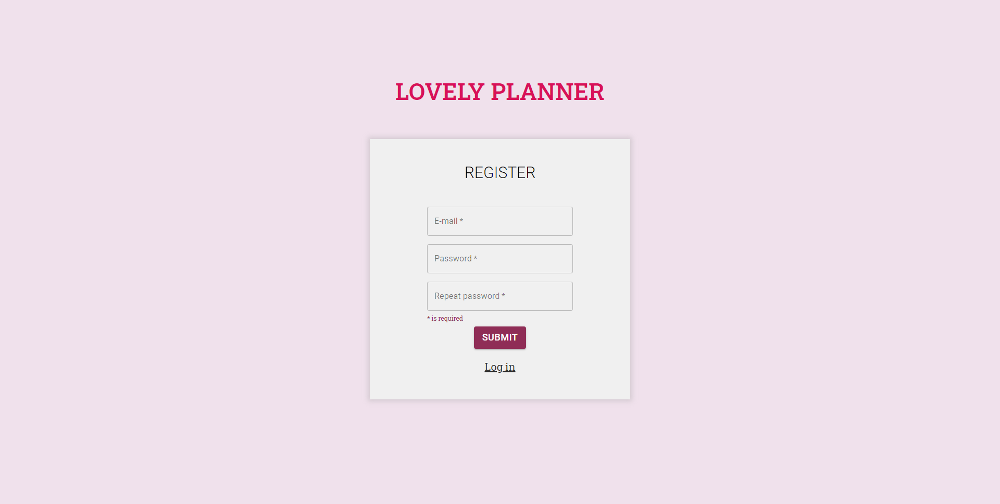
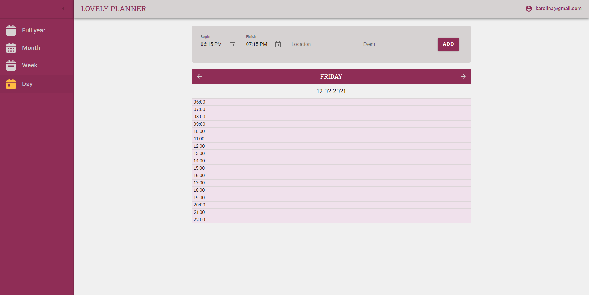

# Planner

This project was bootstrapped with [Create React App](https://github.com/facebook/create-react-app).

## Table of contents

- [Introduction](#introduction)
- [Technologies](#technologies)
- [State managment](#statemanagnent)
- [Backend](#backend)
- [Setup](#setup)
- [Screenshots](#screenshots)

### Introduction

This is my own planner which I design myself. I am still working on this project.

### Technologies

Language:

- TypeScript

Libraries:

- React
- React Router - used to route between multiple pages in the app. Routing logic can be found in the `Router.tsx` file.
- Styled Components - CSS-in-JS library used to style React apps.
- Material-UI - React components

### State management

I am using Redux to state management.

### Backend:

I used Firebase to authorization and store data.

### Setup

I created this project only for develop my skills and my own using. If you want to see it locally you need to create project on Firebase and put your personal credentials.

To run this project, install it locally using npm:

```
$ git clone https://github.com/CoralineK/pokemon-catcher.git
$ cd ./planner
$ npm install
$ touch .env
```

Now open .env file and add your credentials:

REACT_APP_FIREBASE_KEY="..." <br />
REACT_APP_FIREBASE_DOMAIN="..." <br />
REACT_APP_FIREBASE_PROJECT_ID="..." <br />
REACT_APP_FIREBASE_STORAGE_BUCKET="..." <br />
REACT_APP_FIREBASE_SENDER_ID="..." <br />
REACT_APP_FIREBASE_APP_ID="..." <br />
REACT_APP_FIREBASE_MEASUREMENT_ID="..."

```
$ npm start
```

### Screenshots

These are examples of how application look like at present:




